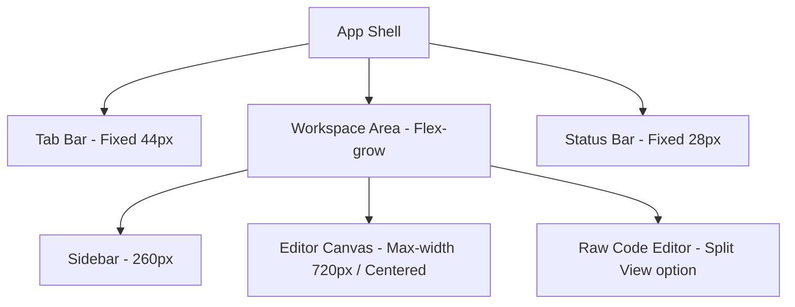

# MD Editor: Visual Identity & Design System Specification

Welcome to the design specification for **MD**, a premium, desktop-native Markdown focused editor. This document captures MD's dark-mode visual identity, based on the **"Prose Logic" / "MD"** design system board.

---

## 1. Visual Identity & Brand Philosophy

The visual styling of **MD** is engineered for high-efficiency markdown editing, blending the structural rigor of a code editor with the refined whitespace of a modern documentation tool. 

*   **Low-Chrome Philosophy**: We reduce the visual footprint of the interface chrome (headers, panels, status bars) to give total precedence to the writer's content.
*   **Minimalist-Modern Aesthetic**: We avoid gradients, blurs, and skeuomorphism in favor of solid fills, crisp 1px borders, and clear typographic hierarchy.
*   **Calm & Technical Precision**: A high-contrast functional dark-mode palette designed for long-duration reading and writing, evoking a sense of calm and focus.

---

## 2. Design Tokens & System Variables

The visual system is defined by the following foundational design tokens.

### 2.1 Colors

The palette uses a high‑contrast functional color scheme. The application ships in **dark mode** by default, using the dark‑theme token values shown in the first table. A secondary **light‑mode** token table is provided for reference and for possible future theme toggle.

| Token Name | Dark Mode Color | Light Mode Color | Design Intent / Usage |
| :--- | :--- | :--- | :--- |
| **Primary** | `#c7bfff` | `#6244FF` | Violet. Reserved for primary actions, active states, and focus indicators. |
| **Secondary** | `#c7bfff` | `#756CC3` | Muted lavender. Handles secondary UI elements, borders, and inactive status indicators. |
| **Tertiary** | `#ffaaf7` | `#97009C` | Deep magenta. Provides a distinct accent for specific semantic highlights (e.g. footnotes, search highlights). |
| **Neutral** | `#787582` | `#787582` | Cool slate‑gray. Used for text‑muted, metadata, and structural outlines. |
| **Background / Surface** | `#13121c` | `#fbf8ff` | Base surface color. |
| **Surface Bright** | `#3a3843` | `#fbf8ff` | Used for tooltips, hover highlights, and active panels. |
| **Surface Container** | `#201e29` | `#f0edf4` | Primary workspace canvas, editor cards, and sidebars. |
| **Surface Variant** | `#35333f` | `#eae7ee` | Muted buttons, inactive tab backgrounds, and hover list item states. |
| **On‑Surface** | `#e5e0ef` | `#1b1b20` | High‑contrast light gray for body text and primary labels. |
| **On‑Surface Variant** | `#c8c4d9` | `#434655` | Secondary text, placeholders, and auxiliary indicators. |

---

### 2.2 Typography

MD distinguishes clearly between **UI Typography** (menus, settings, status) and **Content Typography** (the prose being edited).

#### Font Families
*   **Headline Font**: `Hanken Grotesk` (clean, geometric style for content structure).
*   **Body & UI Font**: `Fira Sans` (highly legible, structured sans-serif).
*   **Code Font**: `Courier Prime` / `Cascadia Code` (monospace for raw markdown syntax and code blocks).

#### Text Styles & Hierarchy
*   **`content-h1`**: `Hanken Grotesk`, `30px` size, `700` weight, `40px` line-height.
*   **`content-h2`**: `Hanken Grotesk`, `24px` size, `600` weight, `32px` line-height.
*   **`content-h3`**: `Hanken Grotesk`, `20px` size, `600` weight, `28px` line-height.
*   **`content-body`**: `Fira Sans`, `16px` size, `400` weight, `26px` line-height.
*   **`content-code`**: `Courier Prime`, `14px` size, `400` weight, `22px` line-height.
*   **`ui-body` / `ui-semibold`**: `Fira Sans`, `13px` size, `400`/`600` weight, `20px` line-height.
*   **`ui-label-caps`**: `Fira Sans`, `11px` size, `600` weight, `16px` line-height, `0.05em` letter-spacing.

---

### 2.3 Shapes & Rounded Corners

MD utilizes a **Rounded (Level 2)** philosophy to balance professional structure with modern approachability. This grid-aligned feel is optimized for technical productivity.

*   **Standard UI Elements** (Buttons, inputs, small widgets): `0.5rem` (8px).
*   **Medium Elements** (Code blocks, submenus): `0.75rem` (12px).
*   **Containers** (Editor cards, modal sheets, floating panels): `1.0rem` (16px).
*   **Interactive Specifics** (Primary CTAs, circular action icons): `full` (999px) for an interactive signature.

---

## 3. Structural Layout & Grid

The interface layout follows a strict "Desktop-Native Shell" model divided into three primary vertical zones:

1.  **Tab Bar (Header)**: Fixed `44px` height. Houses branding dropdowns, window controls, and tab rails.
2.  **Sidebar**: Fixed `260px` width for folders and navigation tree.
3.  **Editor Container**: Flexible viewport, but the text-bearing content area is constrained to a central column of `720px` width to ensure optimal line lengths for reading.
4.  **Status Bar (Footer)**: Fixed `28px` height. Shows metadata (word count, syntax mode, theme toggles) using `ui-body` at 11px.

---

## 4. Component Visual Specifications

Here are the detailed visual requirements for the components implemented in the editor:

### 4.1 Tabs
*   **Active Tab**: Uses the `surface-variant` (`#35333f`) fill with a `0.5rem` corner radius. The text is highlighted in the primary violet color.
*   **Inactive Tab**: Has no background fill and uses the default `ui-body` text style.

### 4.2 App Menu & Dropdowns
*   **Container**: Floating panel with `1.0rem` (16px) corners. 1px solid border using `outline-variant`.
*   **Headers**: Section titles use `ui-label-caps` (`Fira Sans`, 11px, bold, uppercase, tracked) to create a "Pro" software layout.

### 4.3 Floating Selection Toolbar
*   **Description**: Appears contextualized above selected text.
*   **Style**: Inverted relative to the editor canvas for visual contrast. Compact buttons are circular (`border-radius: 50%`), utilizing `var(--accent-soft)` and `var(--accent)` for active tool states.

### 4.4 Find Bar
*   **Description**: Compact card anchored to the top-right of the editor pane.
*   **Style**: Uses `rounded-lg` (1.0rem) corners, containing a single-line text input with no border, using only a bottom separator divider.

### 4.5 Code Blocks
*   **Style**: Background is set to `surface-container` (`#201e29`), utilizing `rounded-md` (`0.75rem` / 12px) corners. Monospaced text uses the `content-code` style with syntax highlighting that respects the primary violet accent (`#6244FF`).

---

## 5. Elevation, Layering & Depth

To maintain a flat modern aesthetic, the interface avoids traditional drop shadows. Depth is communicated via **Tonal Layering** and **1px Borders**:

1.  **Z-Index 0 (Background)**: The deepest layer, utilizing the base `background` color (`#13121c`).
2.  **Z-Index 1 (Panels & Cards)**: Standard workspace cards, sidebars, and editor panels. Sit on container surfaces (`#201e29`) with a 1px `outline-variant` (`#474556`) border.
3.  **Z-Index 2 (Overlays)**: Floating elements (Selection Toolbars, App Dropdowns, Find Bar, Modals). These use higher elevation surfaces (e.g. `#35333f` or `#2a2934`) with a slightly more prominent border or a tight, subtle ambient shadow.
4.  **Dividers**: Always use 1px solid `outline-variant`. No inset or outset bevels.
