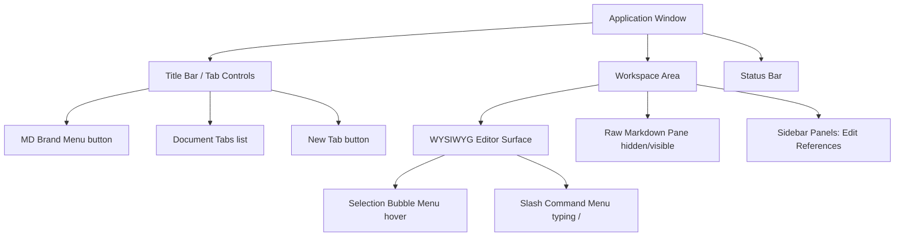

# 📖 MD Editor: In-Depth Feature & User Guide

Welcome to the comprehensive user and technical guide for **MD**. This document covers every layout zone, editor capability, keyboard shortcut, and Markdown trigger implemented in the application.

---

## 🗺️ Application Layout & Interface Zones

The application interface is divided into five primary functional areas designed to keep your focus on writing while retaining immediate access to structural controls.

### 1. Main WYSIWYG Editor Workspace
The central canvas where you write your document. It operates as a distraction-free, rich editor. Standard Markdown symbols (like `**`, `_`, `---`, `#`) disappear as you write, instantly transforming your plain text into stylized headings, lists, tables, and formatted blocks.

### 2. Document Tab Bar
Located at the top of the application window, the tab bar manages your open documents:
- **Tab Indicators:** Each tab displays the document name, an icon, and a green dot indicator if the file has unsaved changes (**dirty state**).
- **Tab Switching:** Click any tab or press `Ctrl + Tab` / `Ctrl + Shift + Tab` to cycle through your open documents.
- **Unsaved Session Snapshots:** Unsaved files are marked as `Untitled-1.md`, `Untitled-2.md`, etc., and are preserved automatically across application restarts.

### 3. Split Pane View (Raw Markdown Editor)
Toggleable via `Ctrl + /` or the **View** section of the brand menu, this splits the screen vertically:
- **Left Side:** The rich WYSIWYG editor.
- **Right Side:** A code-editor text area showing the raw Markdown source code.
- **Bi-directional Live Synchronization:** Editing the WYSIWYG view immediately syncs the raw code. Typing in the raw pane updates the WYSIWYG surface once you pause typing (500ms debounce) or click outside the text area. The raw pane retains its own independent undo stack.

### 4. Brand Menu (Left Sidebar)
Clicking the **MD** logo button in the top-left corner opens the application action sidebar:
- **File Menu:** Open files, create tabs, save documents, trigger system print layouts, or access the settings panel.
- **Open Recent:** Keeps a persistent registry of the last 10 local file paths opened, allowing you to load them instantly or clear the history.
- **View Menu:** Toggle the Raw Markdown Split Pane, or open the **Edit References** sidebar panel.
- **Help Menu:** Check the current version in **About MD** or manually query GitHub for application updates in **Check for Updates**.

### 5. Selection Bubble Menu (Floating Toolbar)
Appears automatically above text selected inside the WYSIWYG editor. It contains layout tools:
- **Styles:** Toggle Bold, Italic, Underline, Strikethrough, Code, Highlight, Subscript, and Superscript.
- **Color Palettes:** Pick text colors or highlight backgrounds from a preset swatch library or use the custom RGB color picker.
- **Node Conversions:** Instantly turn selected lines into Headings (H1 to H6), Bullet/Ordered/Task lists, or Blockquotes.
- **Links:** Insert or modify hyperlinks, or click **Unlink** to strip links.
- **Clear Formatting:** The rubber icon strips all inline marks and resets block items back to standard body paragraphs.

### 6. Interactive Slash Command Menu (`/`)
Typing `/` at the start of a block or after a space brings up the command menu. Use `↑` / `↓` and `Enter` or type keywords (e.g. `table`, `img`) to quickly insert structural components:
- **Blocks:** Heading 1-6, Bullet list, Numbered list, Task list, Blockquote, Fenced Code block, Divider.
- **Insert:** Table, Definition list, Table of Contents, Footnote (next sequential ID), Image, Link, Emoji.
- **Formatting:** Bold, Italic, Strikethrough, Highlight, Underline, Inline code, Subscript, Superscript.

---

## 🎯 Deep Dive: Every Feature Explained

### 1. Advanced Text Formatting
- **Standard Marks:** Apply bold (`**text**`), italic (`_text_`), strikethrough (`~~text~~`), and underline (`___text___`) styling. Underline parses and serializes specifically as `___` (triple underscore) to prevent conflicts with other Markdown elements.
- **Highlights:** Color-code important sections. Clicking Highlight in the bubble menu lets you select a custom background color (serialized as `<mark style="background-color: #...">` in the raw Markdown, falling back to standard `==text==` for default colors).
- **Subscript & Superscript:** Script formatting can be applied using delimiters (`~subscript~` and `^superscript^`). The superscript parser is guarded to never trigger on footnote brackets (`[^`).

### 2. Lists & Checklists
- **Bullet & Numbered Lists:** Standard bullet list (`- ` or `* `) and ordered list (`1. `). 
- **Hierarchical Decimals:** Standard nested numbered lists automatically format using nested numbers (e.g., `1.`, `1.1`, `1.2`, `1.2.1`) in both the WYSIWYG interface, raw pane output, and print previews.
- **Interactive Task Lists:** Checklists render as active checkboxes. You can check/uncheck items directly in the WYSIWYG editor, which instantly toggles the raw text bracket (`[ ]` ↔ `[x]`).

### 3. Fenced Code Blocks & Mermaid Previews
- **Shiki Syntax Highlighting:** Multi-line code blocks (fenced with triple backticks) automatically highlight keywords, operators, and comments for supported languages (e.g., Rust, JavaScript, HTML, CSS, C++, Python) via Shiki.
- **Mermaid Diagram Previews:** Fenced code blocks with the language set to `mermaid` compile and render as interactive diagrams (flowcharts, sequence layouts, charts) inside the editor. Double-clicking the diagram opens the editor block to edit the Mermaid text.

### 4. Advanced Block Layouts
- **Tables:** Spawn via the `/` menu or by typing `|*N ` (e.g., `|*3 ` creates a 3x3 table). Supports column resizing by dragging border handles, headers, cell paragraph wrappers, and custom cell selections.
- **Definition Lists:** Typable using standard Kramdown format in the raw pane (Term line followed by `: Definition` line). Beautifully formatted in the WYSIWYG editor as indented term/definition pairs (`<dl>`).
- **Table of Contents:** Inserted via `[toc]` or `/` menu. Renders a dotted-border navigation box scanning H1, H2, and H3 headers. Supports hierarchical decimal numbers matching header structures. The box can be collapsed, expanded, or manually updated with the **Update ToC** button.

### 5. Media, Links, and References
- **Images:** Insert images via ``. Clicking an image highlights it and opens a menu to change its path (via a local file explorer or URL dialog) or delete it. Images can be dragged and dropped inside the WYSIWYG editor to move them.
- **Hyperlinks:** Double-clicking links or selecting text to add a link creates a standard `[label](url)` tag. Internal `http`/`https` links render a subtle `↗` indicator and prompt with a security confirmation warning before opening in the browser.
- **Footnotes:** Renders inline footnote links `[^1]` matched to definitions `[^1]: My definition` placed at the bottom. Footnote references automatically compile sequentially as you insert them.
- **Link Reference Definitions:** Renders tidy inline tags `[Google][ref]` linked to reference declarations at the bottom of the document (`[ref]: https://google.com "Google"`). Easily view and manage all document reference definitions in the **Edit References** sidebar panel.

### 6. Interactive Find & Replace
Triggered via `Ctrl + F` (Find) or `Ctrl + H` (Replace):
- Matches all text instances inside the active tab, rendering bright highlight markers.
- Displays match count (e.g. `1 of 12`) and features Next (`Enter` / `↓`) and Previous (`Shift + Enter` / `↑`) button navigation.
- Replace bar allows modifying the active match individually or executing a **Replace All** command.

---

## ⌨️ Complete Keybindings & Delimiter Reference

### 1. Markdown Delimiter Triggers (Auto-Formatting)
Type these delimiters directly on the WYSIWYG surface to format text as you write:

| Element Type | Markdown Delimiter | Formatting Effect |
| :--- | :--- | :--- |
| **Italic** | `_italic_` or `_ ` + `Space` | Converts text to italicized font |
| **Bold** | `**bold**` or `__bold__` | Converts text to bold font |
| **Underline** | `___underline___` | Underlines selected text |
| **Strikethrough** | `~~strikethrough~~` | Draws a line through the text |
| **Highlight** | `==highlight==` | Highlights text background |
| **Inline Code** | `` `code` `` | Formats text as monospaced code |
| **Subscript** | `~subscript~` | Subscripts text below line baseline |
| **Superscript** | `^superscript^` | Superscripts text above line baseline |
| **Headings (1-6)** | `# ` to `###### ` (at start of line) | Converts line to H1 - H6 Heading |
| **Bullet List** | `- ` or `* ` (at start of line) | Converts line to a bulleted list |
| **Numbered List** | `1. ` (at start of line) | Converts line to a numbered list |
| **Task Checklist** | `[ ] ` or `[x] ` (at start of line) | Converts line to a checklist item |
| **Blockquote** | `> ` (at start of line) | Converts line to an indented blockquote |
| **Horizontal Rule** | `---` or `***` (on new line) | Inserts a divider line |
| **Table Spawning** | `\|*N ` (e.g., `\|*3 ` + `Space`) | Inserts an `N` x `N` resizable table |
| **Definition List** | `: ` (after a term line) | Appends definition to the preceding term |
| **Footnote Ref** | `[^label]` | Spawns a sequential footnote index |
| **Emoji Shortcode** | `:shortcode:` (e.g., `:smile:`) | Replaces shortcode with emoji glyph |

### 2. Global System Shortcuts

| Action | macOS Shortcut | Windows / Linux Shortcut | Range of Effect |
| :--- | :--- | :--- | :--- |
| **New Editor Tab** | `Cmd + T` | `Ctrl + T` | Application-wide |
| **Close Editor Tab** | `Cmd + W` | `Ctrl + W` | Application-wide |
| **Cycle Tabs (Next)** | `Cmd + Tab` | `Ctrl + Tab` | Application-wide |
| **Cycle Tabs (Previous)** | `Cmd + Shift + Tab` | `Ctrl + Shift + Tab` | Application-wide |
| **Open File** | `Cmd + O` | `Ctrl + O` | Application-wide |
| **Save Active File** | `Cmd + S` | `Ctrl + S` | Application-wide |
| **Save File As...** | `Cmd + Shift + S` | `Ctrl + Shift + S` | Application-wide |
| **Print Document** | `Cmd + P` | `Ctrl + P` | Application-wide |
| **Find Text** | `Cmd + F` | `Ctrl + F` | Active Viewport |
| **Find & Replace** | `Cmd + H` | `Ctrl + H` | Active Viewport |
| **Toggle Split Pane** | `Cmd + /` | `Ctrl + /` | Active Viewport |
| **Zoom Workspace In** | `Cmd + +` or `Cmd + Scroll Up` | `Ctrl + +` or `Ctrl + Scroll Up` | Application-wide |
| **Zoom Workspace Out**| `Cmd + -` or `Cmd + Scroll Down` | `Ctrl + -` or `Ctrl + Scroll Down` | Application-wide |
| **Reset Workspace Zoom**| `Cmd + 0` | `Ctrl + 0` | Application-wide |
| **Open Preferences** | `Cmd + ,` | `Ctrl + ,` | Application-wide |

### 3. Editor Rich Formatting Shortcuts

| Action | macOS Shortcut | Windows / Linux Shortcut | Range of Effect |
| :--- | :--- | :--- | :--- |
| **Toggle Bold** | `Cmd + B` | `Ctrl + B` | Active text selection |
| **Toggle Italic** | `Cmd + I` | `Ctrl + I` | Active text selection |
| **Toggle Underline** | `Cmd + U` | `Ctrl + U` | Active text selection |
| **Toggle Strikethrough**| `Cmd + Shift + X` | `Ctrl + Shift + X` | Active text selection |
| **Toggle Inline Code** | `Cmd + E` | `Ctrl + E` | Active text selection |
| **Heading Level 1** | `Cmd + Alt + 1` | `Ctrl + Alt + 1` | Focused text block |
| **Heading Level 2** | `Cmd + Alt + 2` | `Ctrl + Alt + 2` | Focused text block |
| **Heading Level 3** | `Cmd + Alt + 3` | `Ctrl + Alt + 3` | Focused text block |
| **Heading Level 4** | `Cmd + Alt + 4` | `Ctrl + Alt + 4` | Focused text block |
| **Heading Level 5** | `Cmd + Alt + 5` | `Ctrl + Alt + 5` | Focused text block |
| **Heading Level 6** | `Cmd + Alt + 6` | `Ctrl + Alt + 6` | Focused text block |
| **Create Bullet List** | `Cmd + Shift + 8` | `Ctrl + Shift + 8` | Focused text block |
| **Create Ordered List**| `Cmd + Shift + 7` | `Ctrl + Shift + 7` | Focused text block |
| **Create Task Checklist**| `Cmd + Shift + 9` | `Ctrl + Shift + 9` | Focused text block |
| **Blockquote Block** | `Cmd + Shift + B` | `Ctrl + Shift + B` | Focused text block |
| **Create Code Block** | `Cmd + Alt + C` | `Ctrl + Alt + C` | Focused text block |
| **Hard Break** | `Shift + Enter` | `Shift + Enter` | Inline cursor |
| **Undo Last Action** | `Cmd + Z` | `Ctrl + Z` | Active Editor |
| **Redo Last Action** | `Cmd + Y` or `Cmd + Shift + Z` | `Ctrl + Y` or `Ctrl + Shift + Z` | Active Editor |

---

## ⚙️ Settings Preferences & Storage

### 1. Configuration File Options
Preferences adjusted in the **Settings dialog (`Ctrl + ,`)** take effect instantly and are serialized to `config.json` inside the application storage directory:
- **Theme Mode:** Choose between `system` (syncs with OS light/dark modes), `light`, or `dark`.
- **Restoring Sessions:** Toggles whether MD reopens your previously active tabs upon launch.
- **Font Size & Zoom:** Adjust the font scale (percentage of standard layout) and global interface zoom.
- **Emoji Format:** Select whether emojis are saved to raw Markdown files as Unicode symbols (`😄`) or Markdown shortcodes (`:smile:`).
- **Auto-Save Time:** Sets the delay (in milliseconds) before unsaved changes are written to disk.

### 2. Application Files Directory
All settings, log outputs, and tab snapshot session data are written to:
- **Installed Mode:** `%APPDATA%\MD\` (on Windows)
- **Portable Mode:** `{executable_directory}\MD\`
