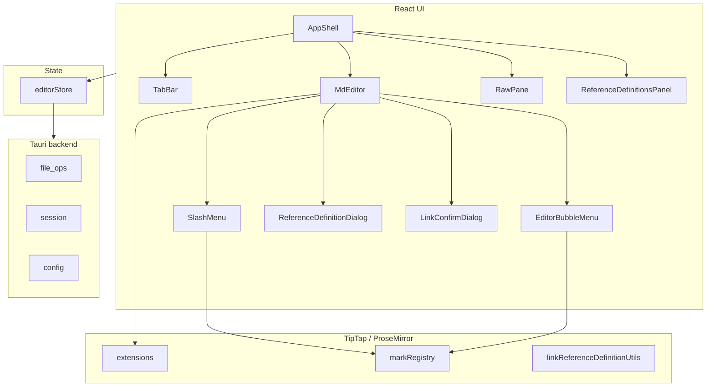
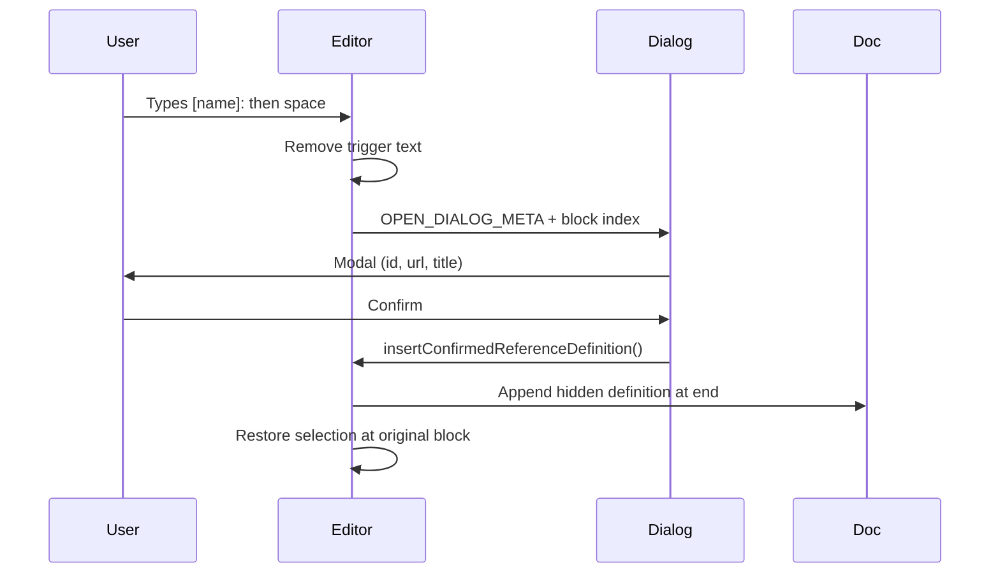

# MD — Implementation Plan

Lightweight WYSIWYG Markdown desktop editor for Windows. The product goal is a Typora-style writing experience: formatted text on screen, valid Markdown on disk, minimal chrome, and fast local-first workflows.

## Product goals

| Goal | Description |
|------|-------------|
| WYSIWYG editing | Markdown markers disappear as you type; formatting is visible immediately |
| Faithful Markdown | `.md` files remain the source of truth with GFM-oriented round-trip |
| Lightweight shell | Tauri 2 desktop app with low overhead vs. Electron |
| Familiar UX | Tabs, slash commands, selection toolbar, hidden raw pane |
| Session continuity | Restore open tabs (including unsaved content) on launch by default |
| Distribution | Windows installer with `.md` association; portable mode via `portable.flag` |

## Tech stack

| Layer | Choice |
|-------|--------|
| Desktop shell | Tauri 2 (Rust) |
| UI | React 19 + TypeScript + Vite |
| Editor | TipTap 3 + ProseMirror + `@tiptap/markdown` |
| Syntax highlighting | Shiki (GitHub light/dark themes) |
| State | Zustand (`editorStore`) |
| Persistence | Rust file I/O → `%APPDATA%\MD\` or portable `{exe_dir}\MD\` |

## Architecture overview



### Core design patterns

1. **Mark registry** — Single command bus (`src/editor/markRegistry.ts`) shared by slash menu, selection toolbar, and inline delimiter input rules.
2. **Markdown round-trip** — TipTap `Markdown` extension plus custom serializers/parsers for colors, footnotes, and reference definitions.
3. **Hidden document tail** — Completed link reference definitions live at document end, hidden in WYSIWYG via CSS, editable via panel or modal.
4. **Bridge pattern for modals** — Editor plugins request UI through small bridge modules (e.g. `referenceDefinitionDialogBridge.ts`) consumed by `MdEditor.tsx`.

## Phased roadmap

### Phase 1 — Application shell (complete)

Foundation for a usable editor window.

- Tauri app with file open/save/save-as dialogs
- Tab bar (new, close, switch, middle-click close)
- Session persistence (`session/*.json`) with periodic auto-save
- Config persistence (`config.json`)
- Hidden raw Markdown pane (`Ctrl+/`)
- Editor zoom (`Ctrl+±`, `Ctrl+0`, `Ctrl+wheel`)
- System/light/dark theme via `data-theme`
- Status bar (path, save state, wrap, zoom)
- MD application menu (File / View / Help)
- Keyboard shortcuts (new, open, save, close tab, print, tab cycle)
- `.md` / `.markdown` file association in bundle config
- Portable storage when `{exe_dir}/MD/portable.flag` exists

**Key files:** `src-tauri/`, `src/stores/editorStore.ts`, `src/components/AppShell.tsx`, `src/hooks/useKeyboardShortcuts.ts`

---

### Phase 2 — Typora-style inline editing (complete)

Make typing feel like a WYSIWYG editor, not a plain text field.

- **Delimiter toggles** — `**`, `*`, `` ` ``, `~~`, `==` hide markers and toggle marks (`markdownDelimiterMarks.ts`)
- **Emoji shortcodes** — `:name:` → Unicode glyph via gemoji
- **Slash menu** — `/` opens floating command palette at cursor
- **Selection bubble toolbar** — Formatting actions on text selection
- **Block input rules** — Started in Phase 4 (`inlineBlockTriggers.ts`); headings/lists/quote/task/hr at line start

**Key files:** `src/editor/markdownDelimiterMarks.ts`, `src/components/SlashMenu.tsx`, `src/editor/EditorBubbleMenu.tsx`

---

### Phase 3 — Rich formatting & polish (complete)

Extended formatting beyond basic GFM marks.

- Text color presets in selection toolbar
- Color serialization to inline HTML in raw Markdown (`markdownTextStyle.ts`)
- Highlight with theme-aware contrast tokens
- Emoji picker in slash menu (`constants/emojiPresets.ts`)
- Shiki-backed fenced code blocks with light/dark sync
- Markdown-aware paste (plain text → structured content)
- Task list layout fixes (checkbox + text alignment)
- Unified MD dropdown menu (single brand button)

**Key files:** `src/editor/shikiCodeBlockExtension.ts`, `src/editor/markdownPaste.ts`, `src/styles/app.css`

---

### Phase 4 — Links, references, footnotes, security (complete)

Advanced Markdown features and safer link handling.

#### Completed

- **External link guard** — Click opens confirmation dialog before launching URL (`LinkConfirmDialog`, `linkClickGuard.ts`)
- **Inline links** — Autolink, paste-as-link, `[text](url)`, `[text][ref]` with reference sync
- **Link reference definitions**
  - Typing `[id]:` + space opens **modal dialog** (name, URL, optional title)
  - Full-line paste/type still inserts silently
  - Definitions hidden in editor, serialized at document end
  - **Edit references** side panel for CRUD on completed definitions
  - Reorder + cursor restore on confirm (position-safe, no full-doc cursor jump)
- **Footnotes** — `[^id]` references and `[^id]:` multiline definitions
- **Print** — Hidden iframe print with inline stylesheet (`src/lib/printDocument.ts`); avoids `window.open` (null/blocked in Tauri WebView); `@media print` fallback when no editor is mounted
- **Slash menu fixes** — Positioning, duplicate entries, keyboard navigation performance
- **Editor stability** — OOM/infinite reorder loop fixed; instrumentation removed
- **External link visual indicator** — CSS-only superscript ↗ on `http(s)` links (`app.css`); no schema or serialization impact; internal/anchor links unaffected
- **Full undo/redo UX** — `Ctrl+Z` undo, `Ctrl+Y` / `Ctrl+Shift+Z` redo via TipTap keymap in the editor plus a global fallback in `useKeyboardShortcuts` (skips textarea/input targets so the raw pane keeps native undo); Edit menu with Undo/Redo entries
- **Footnote definitions** — Kept visible in WYSIWYG by design (they are content, unlike hidden link reference definitions); round-trip verified

#### Deferred (explicitly Phase 5 / 6)

- Settings UI for persisted config (Phase 5)
- Auto-update pipeline (Phase 5)
- Markdown Guide coverage gaps — images, tables UX, sub/superscript typing, etc. (Phase 6)
- Footnote click-to-jump UI (nice-to-have; not required for Phase 4)

**Key files:** `src/editor/linkReferenceDefinition*.ts`, `src/components/ReferenceDefinitionDialog.tsx`, `src/editor/footnote*.ts`, `src/editor/markdownLink.ts`

---

### Phase 5 — Settings, updates, and release (in progress)

Ship-quality desktop product.

#### Completed

- **Settings dialog** (`SettingsDialog.tsx`) — exposes all `AppConfig` fields (session restore, theme, font size, word wrap, editor zoom, emoji save mode, raw pane on startup, auto-save interval, update checks); changes apply immediately via `updateConfig` and persist to `config.json`; Reset to defaults button; File menu entry + `Ctrl+,`
- **Update check stub** — Help → "Check for Updates…" opens `UpdateCheckDialog.tsx` (current version + View releases link via opener plugin); startup check honors `config.checkUpdates` as a logging no-op until a release endpoint exists
- **Recent files** — last 10 opened/saved paths in `config.recentFiles` (TS `AppConfig` + Rust struct with `#[serde(default)]`); File > Open Recent items + Clear Recent
- **Find/replace** (`FindReplaceBar.tsx`) — `Ctrl+F` find / `Ctrl+H` replace over the active editor; ProseMirror decoration highlights, match count, next/prev (Enter/Shift+Enter), replace one/all, Escape closes

#### Deferred (release engineering)

- Full auto-update requires `tauri-plugin-updater`, a signing keypair, and a release endpoint — out of scope without a remote/release server
- Installer smoke tests (per-user + per-machine NSIS modes) and portable bundle docs remain manual QA tasks

---

### Phase 6 — Markdown Guide parity (in progress)

Target coverage aligned with [Basic](https://www.markdownguide.org/basic-syntax/), [Extended](https://www.markdownguide.org/extended-syntax/), and [Hacks](https://www.markdownguide.org/hacks/) syntax.

#### Completed

1. **Block UX** — Slash menu "Table" (3×3 with header row), "Image" (`ImageInsertDialog.tsx`), and "Link" (`LinkInsertDialog.tsx`); ` ```lang ` line-start trigger in `inlineBlockTriggers.ts`
2. **Inline UX** — Subscript/superscript in `markRegistry` (slash menu + selection toolbar); `^` superscript input rule with footnote (`[^`) guard; highlight color swatches + remove-highlight in the bubble menu, with `MarkdownHighlight` serializing colored highlights as `<mark style>` and default as `==…==`
3. **Link UX** — Bubble menu and slash menu link dialogs (`LinkEditDialog.tsx` / `LinkInsertDialog.tsx`) to add/update/remove links with optional title
4. **Hard breaks** — Shift+Enter `<br>` via StarterKit HardBreak; `@tiptap/markdown` serializes as backslash break

#### Deferred / out of scope

- `~` subscript input rule — conflicts with `~~` strikethrough; subscript stays slash/toolbar only
- Definition lists, image paste/drag-drop, markdown line-start table trigger
- Escaping and raw HTML blocks — explicitly out of scope for now
- Emoji shortcode round-trip (`emojiSaveMode: "shortcode"`) — config only

## Reference definition flow (current)

This replaced an earlier inline hidden-block approach after UX and cursor-mapping issues.



**Rules**

- Incomplete `[id]:` lines never become permanent blocks mid-typing
- Only confirmed definitions are reordered to document tail
- WYSIWYG hides all `.md-link-ref-definition` nodes; panel/dialog are the edit surfaces

## Storage layout

| Mode | Root |
|------|------|
| Installed | `%APPDATA%\MD\` |
| Portable | `{executable_dir}\MD\` when `portable.flag` exists |

| File | Purpose |
|------|---------|
| `config.json` | User preferences (`AppConfig`) |
| `session/` | Tab snapshots for session restore |

## Source map (editor-focused)

| Path | Responsibility |
|------|----------------|
| `src/editor/extensions.ts` | Extension bundle assembly |
| `src/editor/markRegistry.ts` | Shared formatting commands |
| `src/editor/markdownDelimiterMarks.ts` | Inline delimiter + emoji input rules |
| `src/editor/inlineBlockTriggers.ts` | Line-start block triggers |
| `src/components/SlashMenu.tsx` | Slash command palette |
| `src/editor/EditorBubbleMenu.tsx` | Selection formatting toolbar |
| `src/editor/linkReferenceDefinitionUtils.ts` | Definition CRUD, reorder, selection helpers |
| `src/editor/linkReferenceDefinitionExtension.ts` | Definition node + dialog trigger |
| `src/editor/linkReferenceDefinitionMaintain.ts` | Post-edit maintenance plugin |
| `src/components/ReferenceDefinitionDialog.tsx` | Modal for new definitions |
| `src/components/ReferenceDefinitionsPanel.tsx` | Side panel editor |
| `src/editor/markdownLink.ts` | Links + reference link href sync |
| `src/editor/footnoteExtension.ts` | Footnote reference marks |
| `src/editor/footnoteDefinitionExtension.ts` | Footnote definition blocks |
| `src/editor/shikiCodeBlockExtension.ts` | Shiki code block node view |
| `src/stores/editorStore.ts` | Tabs, I/O, config, session |
| `src-tauri/src/file_ops.rs` | Read/write + portable detection |

## Development commands

```bash
npm install
npm run tauri:dev      # Dev with hot reload
npm run tauri:build    # Production bundle
npx tsc --noEmit       # Typecheck
```

## Success criteria for v1.0

- [ ] All Phase 1–3 items stable on Windows 10/11
- [ ] Phase 4 link/reference/footnote flows complete without cursor or OOM regressions
- [x] Settings UI exposes all `AppConfig` fields
- [x] Auto-update or documented manual update path (manual check dialog; full updater is a release-engineering follow-up)
- [x] Markdown Guide checklist at ≥90% for writer-facing syntax (definition lists, escaping, HTML blocks excluded)
- [ ] Installer + portable mode verified on clean machines
